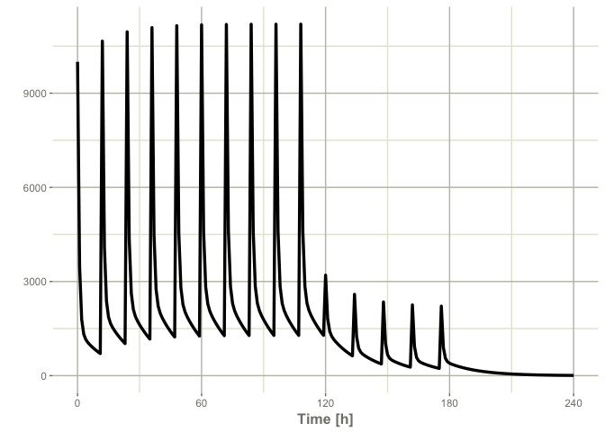

# mixr-validation

babelmixr2, nonmem2rx validation

## datasets

- The datasets are imported from the article. (CPT Pharmacometrics Syst
  Pharmacol . 2019 Aug;8(8):525-537. doi: 10.1002/psp4.12404. Epub 2019
  Jun 13. NONMEM Tutorial Part I: Description of Commands and Options,
  With Simple Examples of Population Analysis)
  https://ascpt.onlinelibrary.wiley.com/doi/10.1002/psp4.12404

<!-- -->

    nmfe75 402.ctl 402.res -prdefault
    nmfe75 504.ctl 504.res -prdefault

``` r
library(nonmem2rx)
mod1 <- nonmem2rx("psp-1/402.ctl", lst=".res", save=FALSE)
mod2 <- nonmem2rx("psp-2/504.ctl", lst=".res", save=FALSE)
```

``` r
library(rxode2)
```

    rxode2 2.0.13 using 1 threads (see ?getRxThreads)
      no cache: create with `rxCreateCache()`

    ========================================
    rxode2 has not detected OpenMP support and will run in single-threaded mode
    This is a Mac. Please read https://mac.r-project.org/openmp/
    ========================================

``` r
ev  <- et(amountUnits="mg", timeUnits="hours") %>%
  et(amt=10000, addl=9, ii=12) %>%
  et(time=120, amt=2000, addl=4, ii=14) %>%
  et(0:240) # Add sampling 
mod1_ev <- mod1 %>% rxSolve(ev)
```

    ℹ using nocb interpolation like NONMEM, specify directly to change

    ℹ using sigma from NONMEM

    ℹ using NONMEM specified atol=1e-12

    ℹ using NONMEM specified rtol=1e-12

    ℹ using NONMEM specified ssRtol=1e-12

    ℹ using NONMEM specified ssAtol=1e-12

``` r
plot(mod1_ev, central)
```


